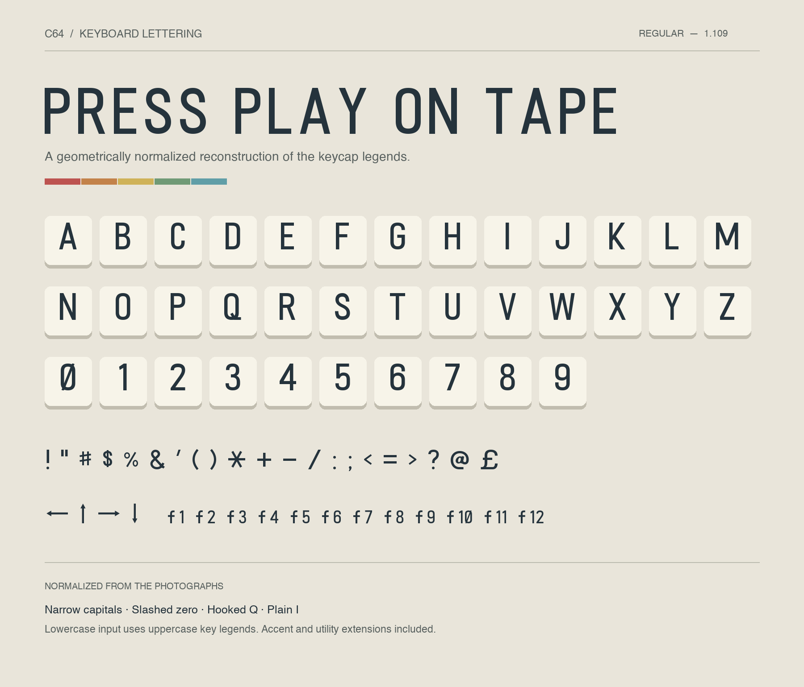
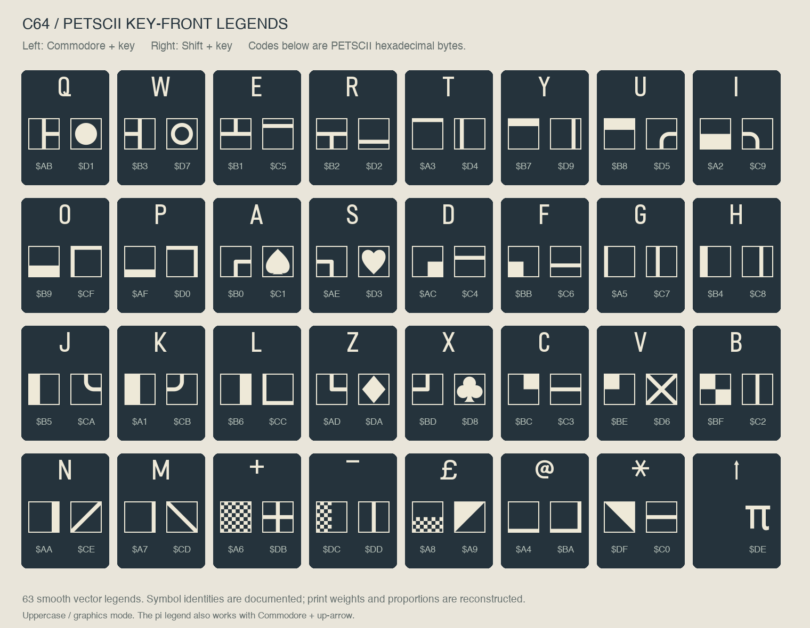

# C64 Keyboard

A font recreated from photographs of classic Commodore 64 keycaps, with cleaned-up shapes and consistent proportions.

**[Download TTF](fonts/C64Keyboard-Regular.ttf?raw=true)** · [OTF](fonts/C64Keyboard-Regular.otf?raw=true) · [Webfont](fonts/C64Keyboard-Regular.woff2?raw=true) · [Complete package](C64-Keyboard.zip?raw=true)

## Use it

Install the TTF or OTF, then select **C64 Keyboard** in your application.

To try it out, download and extract the complete package, then open `preview.html`. Click a special-key or PETSCII button to insert its symbol into the type tester, then copy the text into your application and select **C64 Keyboard**.

If you have an earlier version installed, replace it with **version 1.109** and restart applications that still show the old font. The former U+E000 symbol is no longer included.

## Included

- Uppercase letters, numbers, punctuation, arrows, £, and π.
- Selected accented letters, including Hungarian characters.
- Function-key labels f1–f12 and classic C64 key legends.
- All 63 PETSCII graphic front legends, arranged by key in the preview.

Lowercase input displays as uppercase. This recreates printed key legends, including smooth geometric reconstructions of the PETSCII graphics, rather than the screen bitmap font.

## PETSCII front legends

Open `preview.html` and use the PETSCII buttons to insert the symbols, then copy them from the type tester. Left legends correspond to Commodore + key, right legends to Shift + key in uppercase/graphics mode. Pi on the up-arrow key also works with Commodore.

These are reconstructed outlines: identities and key assignments come from the [Ultimate Commodore 64 Reference](https://www.pagetable.com/c64ref/charset/); frame thickness, curves, and print proportions are inferred from the supplied keyboard photograph. They are not exact photo traces. Pi is unframed as on the key.

The preview handles the special character codes for you. Copied symbols need this font to display correctly. See the [PETSCII key map and encoding guide](docs/PETSCII.md) for codes and keyboard combinations.

Editable outlines are in [glyphs/](glyphs/), with build tools in [scripts/](scripts/). Original photographs are not included.

[Build instructions](docs/BUILDING.md) · [Version history](CHANGELOG.md)

## License

To the extent possible under law, Levente Szabadkai dedicates the copyright and related rights he holds in this repository to the public domain under [CC0 1.0 Universal](LICENSE). This covers the font files, editable outlines and traces, build scripts, preview, documentation, mappings, and specimen images. You may use, modify, and redistribute these contributions, including commercially, without attribution.

The private source photographs are not included. CC0 does not grant rights held by others in the historical keycap designs or any trademarks. **C64 Keyboard** is an independent, unofficial reconstruction and is not endorsed by Commodore.
